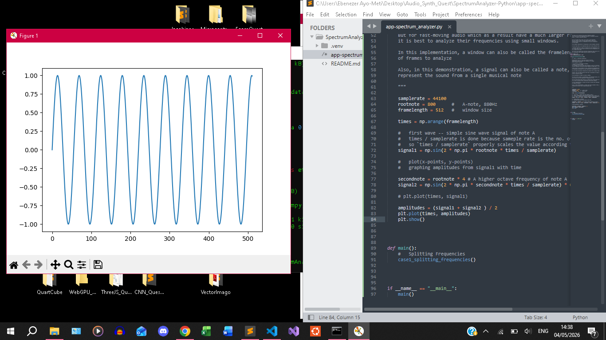
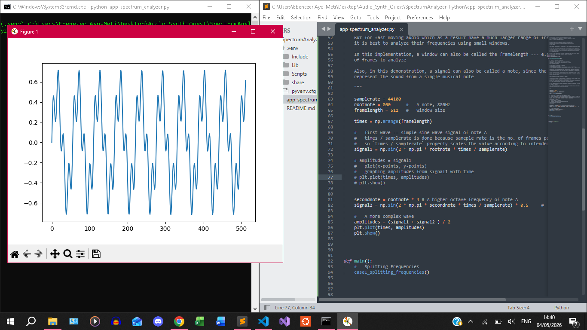
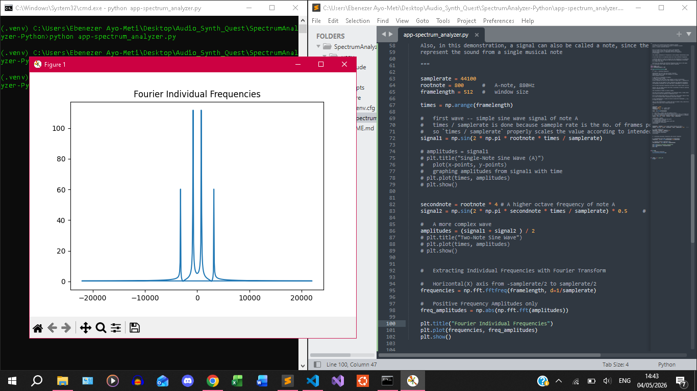
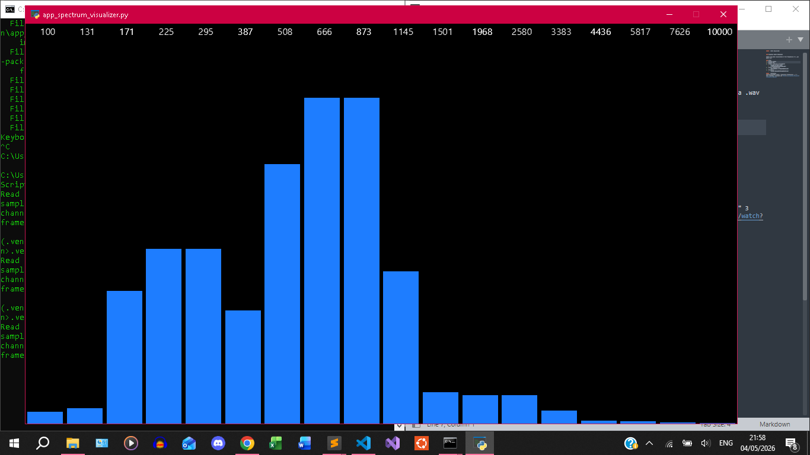

#####	Date: 04-05-2026

###	Frequency Synth Visualizer

Simple real-time visualization of the frequencies of a .wav audio file

###	Setup 
>	Install Python
>	Install Pip
1.	Create * Activate Environment:
	-	`python -m venv .venv`
	-	`.venv\Scripts\activate.bat`
2.	Install Dependencies:
	-	`pip install -r requirements.txt`
3.	Run :
	-	`python app_spectrum_analyzer.py`

#####	References
Codersbringchange (2025), "Unlocking Frequencies: ..." 3 July [Youtube]. Available at: https://www.youtube.com/watch?v=XJ42pfSI-DY&t=10s

#####	Screenshots

